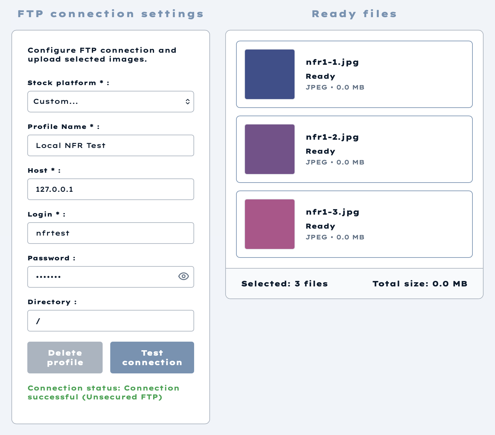
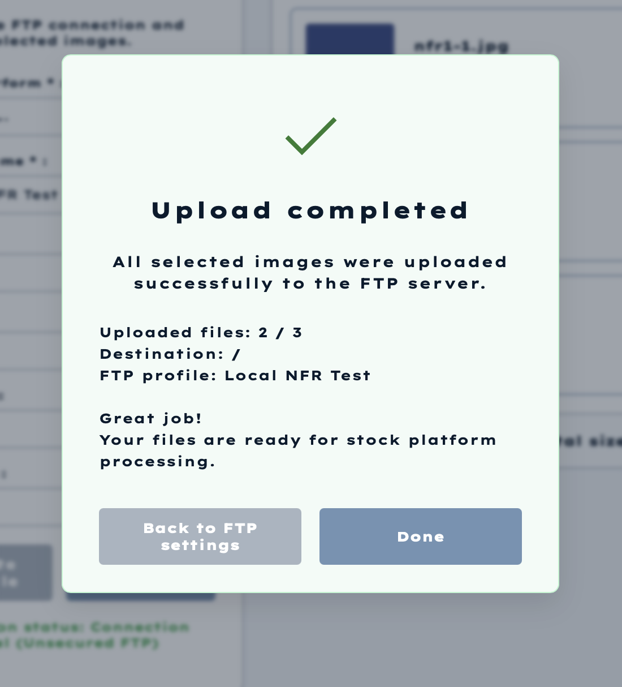

# NFR-1: FTP Upload Reliability

## Test Goal

The goal of this manual integration test was to verify that a failure while uploading one file does not interrupt the remaining FTP upload queue.

The application must:

1. Continue processing files after an individual file fails.
2. Complete the whole queue.
3. Provide separate successful and failed upload results.
4. Display an accurate final summary.

## Test Environment

- Operating system: macOS
- RAM: 16 GB
- CPU: Apple M2 Pro
- Test date: 2026-06-20
- Application branch used for the test: `main`
- FTP server: local `pyftpdlib`
- FTP host: `127.0.0.1`
- FTP port: `21`
- FTP destination: `/`

## Test Data

Three JPEG files were imported and selected:

| File | Prepared state |
|---|---|
| `nfr1-1.jpg` | Available |
| `nfr1-2.jpg` | Made unavailable after import |
| `nfr1-3.jpg` | Available |

The second file was intentionally made unavailable on disk before starting the FTP upload. This created a controlled per-file failure without breaking the FTP connection.

## Test Procedure

1. Start the application backend and frontend.
2. Start a local writable FTP server.
3. Import the three JPEG files.
4. Select all three files for FTP upload.
5. Configure the local FTP profile.
6. Verify that the FTP connection succeeds.
7. Make `nfr1-2.jpg` unavailable on disk.
8. Start the FTP upload for all three selected files.
9. Verify the final upload summary and the contents of the FTP destination.

## Expected Result

- `nfr1-1.jpg` uploads successfully.
- `nfr1-2.jpg` fails.
- `nfr1-3.jpg` still uploads successfully.
- The final summary reports two successful files and one failed file.
- The failed filename and reason are visible to the user.

## Actual Result

The FTP connection was established successfully and all three files were included in the queue.



The final modal displayed:

```text
Uploaded files: 2 / 3
Destination: /
FTP profile: Local NFR Test
```



The FTP destination contained:

```text
nfr1-1.jpg
nfr1-3.jpg
```

`nfr1-2.jpg` was not uploaded. The failure did not stop the third file from being processed.

## Results

| Check | Result |
|---|---|
| Queue continues after one file fails | Passed |
| Remaining valid files are uploaded | Passed |
| Final successful count is correct (`2 / 3`) | Passed |
| Failed filename and error are shown in the UI | Failed |
| Summary text correctly describes a partial upload | Failed |
| Per-file results are persisted for later review | Not confirmed |

## Defect Found

The success modal states:

```text
All selected images were uploaded successfully to the FTP server.
```

This message is incorrect because the same modal reports `Uploaded files: 2 / 3`. The UI does not display the failed filename or the failure reason.

## Conclusion

Overall result: **partially passed**.

The main reliability behaviour was confirmed: an individual file failure did not interrupt the remaining FTP queue. However, NFR-1 is not fully satisfied because the final UI summary is misleading, the failed file is not identified to the user, and persistent per-file operation results were not confirmed.
