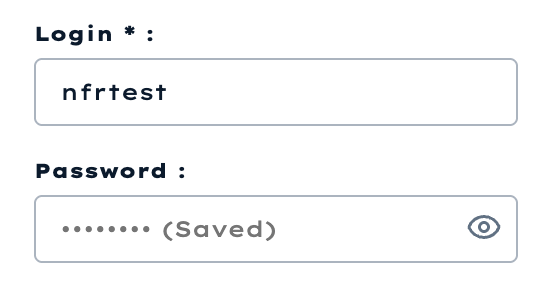
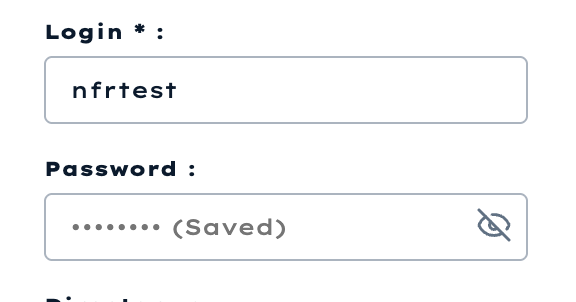

# NFR-4: Local Data Security

## Test Goal

The goal of this manual security test was to verify that an FTP password is not stored or displayed as plain text after an FTP profile is saved.

The application must:

1. Mask the password in the interface.
2. Store an encrypted value instead of the original password.
3. Exclude the password and encrypted value from FTP profile API responses.

## Test Environment

- Operating system: macOS
- Test date: 2026-06-20
- Application branch: `docs-nfr`
- Browser/runtime: local Vite application at `http://127.0.0.1:5173/`
- Database: local SQLite database
- Encryption implementation: Fernet from the `cryptography` package

## Test Data

The existing local FTP profile was used:

| Field | Test value |
|---|---|
| Profile | `Local NFR Test` |
| Login | `nfrtest` |
| Password | Test password entered manually |

The password itself is intentionally not included in this report.

## Test Procedure

1. Open the FTP section of the application.
2. Select the `Local NFR Test` profile.
3. Enter the test password and save the profile by testing the connection.
4. Reload the application and select the saved profile again.
5. Verify that the saved password is not returned to the password field.
6. Toggle the password visibility button.
7. Verify that the saved password cannot be displayed.
8. Inspect the `ftp_profiles.encrypted_password` value in the local database.
9. Verify that the FTP profile API response does not contain a password field.

## Expected Result

- The saved password is represented by a mask.
- Toggling visibility does not reveal the previously saved password.
- The database value differs from the original password and has the format of an encrypted Fernet token.
- The API returns connection profile fields but does not return the password or encrypted token.

## Actual Result

After saving, the password input was cleared and displayed the saved-password placeholder:



After toggling visibility, the password was still not revealed:



The database check returned:

```text
encrypted value length: 100
encrypted value equals test password: false
encrypted token prefix: gAAAAA...
```

The FTP profile response schema contains the profile name, host, port, login, directory, and ID. It does not expose either `password` or `encrypted_password`.

## Results

| Check | Result |
|---|---|
| Password is masked by default | Passed |
| Saved profile does not repopulate the password field | Passed |
| Visibility toggle cannot reveal the saved password after reload | Passed |
| Database does not contain the password as plain text | Passed |
| API does not return the password | Passed |
| User PIN storage | Not applicable: the MVP has no user accounts or PIN authentication |

## Conclusion

NFR-4 **passed** for the authentication data used by the current MVP. The saved FTP password is retained for future FTP operations, but it is stored as an encrypted token, is not returned to the password field when the profile is loaded again, and is not returned by the API.

User PIN verification is not applicable because the MVP does not contain user accounts or PIN authentication.
