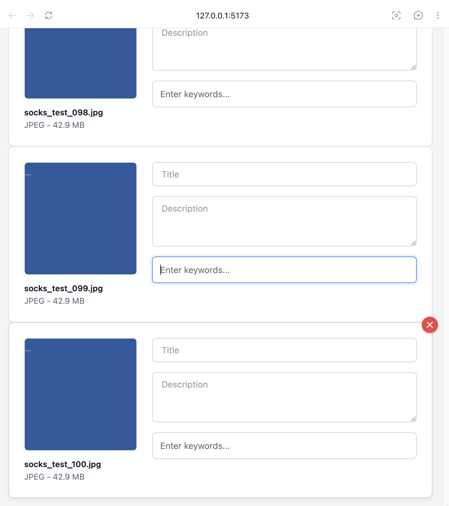
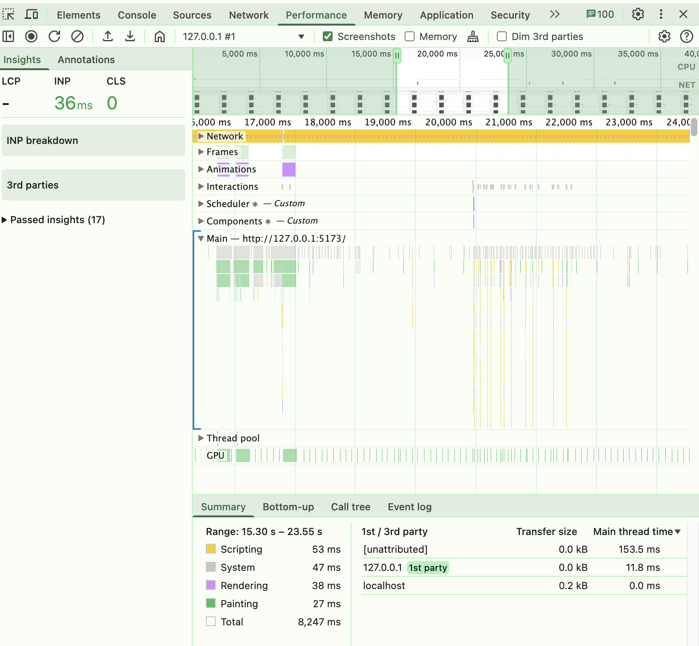

# Performance Test Report: Local JPEG Workspace and Metadata Editing

## Мета тестування

Метою тестування було перевірити виконання нефункціональних вимог до продуктивності застосунку Socks on Stocks:

1. Застосунок має відкривати або імпортувати робочий простір із 100 локальними JPEG-файлами розміром до 45 МБ кожен не довше ніж за 5 секунд на комп'ютері з мінімум 8 ГБ оперативної пам'яті.
2. Під час редагування метаданих інтерфейс не повинен зависати більше ніж на 1 секунду після зміни значення в полі назви, опису або тегів.

## Тестове середовище

- Операційна система: macOS
- Оперативна пам'ять: 16 ГБ
- Процесор: Apple M2 Pro, 10 cores (6 Performance and 4 Efficiency)
- Версія застосунку / гілка Git: `docs-nfr`
- Дата тестування: 2026-06-12
- Браузер / середовище запуску: Chrome, local Vite app at `http://127.0.0.1:5173/`

## Тестові дані

Для тестування було створено папку зі 100 унікальними JPEG-файлами.

- Кількість файлів: 100
- Розмір одного файлу: 45,000,000 bytes (у UI відображається як 42.9 MB)
- Загальний обсяг даних: 4.5 GB
- Формат файлів: `.jpg`

Тестові файли створюються локально скриптом:

```bash
python3 docs/performance-test/generate_45mb_jpegs.py
```

Підтвердження створення тестових файлів:

```text
Files: 100
Unique sizes: [45000000]
Expected size: 45000000
All OK: True
```

## Тест 1. Відкриття робочого простору зі 100 JPEG-файлами

### Очікуваний результат

Застосунок має відкрити або імпортувати робочий простір зі 100 локальними JPEG-файлами не довше ніж за 5 секунд.

### Метод перевірки

1. Запустити backend і frontend застосунку.
2. Відкрити застосунок у браузері.
3. Імпортувати 100 JPEG-файлів із тестової папки.
4. Заміряти час імпорту секундоміром або за логами.
5. Перевірити, що всі 100 файлів відображаються у робочому просторі.

### Фактичний результат

- Час відкриття / імпорту: 24 секунди
- Кількість імпортованих файлів: 100
- Результат: не пройдено

Скріншот результату імпорту:



### Висновок

Вимога щодо відкриття робочого простору за 5 секунд: не виконана. Фактичний час імпорту 100 JPEG-файлів склав 24 секунди, що перевищує очікуваний максимум у 5 секунд.

## Тест 2. Профілювання UI під час редагування метаданих

### Очікуваний результат

Під час зміни значення в полі назви, опису або тегів інтерфейс не повинен зависати більше ніж на 1 секунду.

### Метод перевірки

Для перевірки було використано Chrome DevTools Performance / React Profiler. Під час запису виконувалося швидке введення тексту в поля метаданих.

### Фактичний результат

- Максимальний зафіксований фриз UI: не більше 153.5 ms у виділеному діапазоні Performance timeline
- Наявність блокування більше 1000 ms: ні
- Результат: пройдено

Скріншот профілювання:



### Висновок

Вимога щодо відсутності зависання інтерфейсу довше 1 секунди: виконана.

## Загальний висновок

Під час тестування було перевірено продуктивність застосунку при роботі зі 100 локальними JPEG-файлами загальним обсягом 4.5 GB та поведінку інтерфейсу під час редагування метаданих.

Загальний результат тестування: не пройдено повністю.

Редагування метаданих пройшло вимогу щодо відсутності UI-фризів понад 1 секунду. Водночас імпорт 100 JPEG-файлів зайняв 24 секунди, тому вимога щодо відкриття або імпорту робочого простору не довше ніж за 5 секунд не виконана.

Якщо вимоги не виконані, необхідно оптимізувати відкриття робочого простору, генерацію прев'ю або рендеринг полів редагування метаданих.
